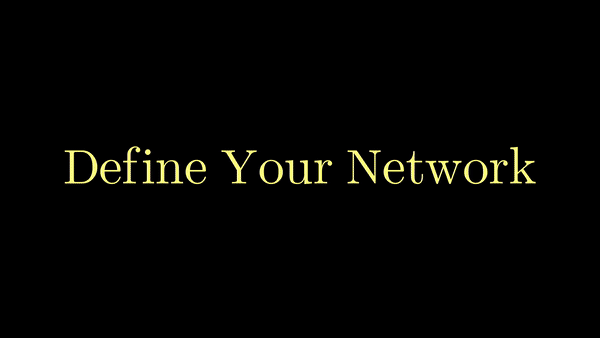

# Image Classification Sandbox



---

## Introduction

The Image Classification Sandbox is an environment enabling quick and easy construction of classification networks for experimentation. The Sandbox has 4 building blocks for experimentation, which can be mixed and matched arbitrarily for a custom network, or assembled to build popular networks (such as Darknet-53). The datasets that are supported are MNIST, ImageNet, and STL10. 

## Try An Experiment

Let's run a simple example. The configuration file defines everything (the network layers, optimizer, augmentatations, etc). Feel free to change or add!
```
python train_classifier.py --config experiments/mnist_conv_vanilla.py
```

---
## Building Blocks

If you would like to experiment with your own architecture, you can define your own config.py file. In the 'layers' field, you have 4 choices. No matter how you define your layers, final output is treated as fully convolutional allowing input images of different sizes. The system automatically appends a 1d convolution to get your feature maps down to your number of output classes and then follows it with a 2d global average and a fully connected layer (inspired by Darknet-53).

__Note:__ Some details are omitted below like batch norms, layer norms, activations, etc


## Infrequently Asked Questions

1. __Why did you build this?__ I wanted to build an environment where I could experiment with transformers originally, but ended up building out other blocks to have baselines and reference points
2. __Can I use this for whatever?__ Yes, go for it.
3. __Do the transformers work?__ Yes they do, but it takes a long time to train them, alot of data, and they can be very finnicky. 


## Citation

If you use ICS in your work or use any models published in MMF, please cite:

```bibtex
@misc{Bartholomew2021ICS,
  author =       {Bartholomew, John}
  title =        {Image Classification Sandbox},
  howpublished = {\url{https://github.com/JBartholomewMN/Image-Classification-Sandbox}},
  year =         {2021}
}
``
